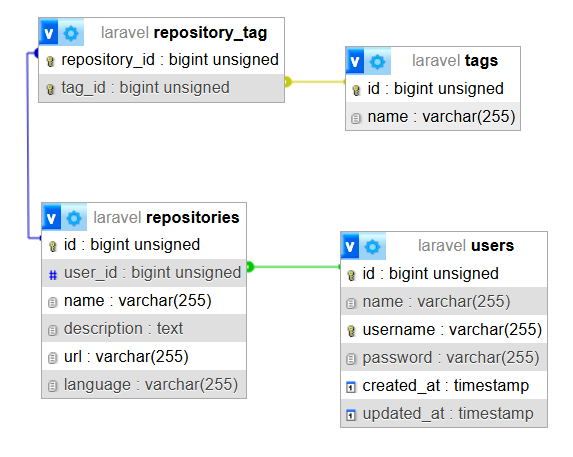

### Project Overview

This project is designed to manage and organize GitHub starred repositories effectively. It provides an API that allows users to synchronize their starred repositories from GitHub, retrieve lists of repositories along with associated tags, edit tags for specific repositories, and search for repositories based on partial tag names. The project leverages Laravel's robust framework capabilities to facilitate these functionalities, ensuring a smooth and efficient user experience.

### API Documentation

After the installation, you can access the API documentation by navigating to the following URL:

[http://127.0.0.1:8000/docs/api](http://127.0.0.1:8000/docs/api)

This documentation provides a comprehensive overview of all the available endpoints, request parameters, and response formats.

Make sure your development server is running before trying to access the documentation.

### Installation Guide

Follow the steps below to install the project:

#### Prerequisites:

-   **PHP 8.3** or higher

-   **Composer**

-   **MySQL** (or any other database of your choice)

-   **Web Server** (e.g., Apache or Nginx)

-   **Git**

#### Step 1: Clone the Repository

First, clone the project repository from GitHub:

```sh

git clone git@github.com:mahdirezaei-dev/footballi.git

cd footballi

```

#### Step 2: Install Dependencies

Install the PHP dependencies using Composer:

```sh

composer install
```

#### Step 3: Configure Environment Variables

Copy the example environment file and configure it according to your setup:

```sh
cp .env.example .env
```

Edit the `.env` file and set up your database connection and other necessary configurations. For example:

```plaintext

DB_CONNECTION=mysql

DB_HOST=127.0.0.1

DB_PORT=3306

DB_DATABASE=your_database_name

DB_USERNAME=your_database_user

DB_PASSWORD=your_database_password


GITHUB_API_TOKEN=your_github_token

```

#### Step 4: Generate Application Key

Generate the application key:

```sh

php artisan key:generate

```

#### Step 5: Generate JWT Secret

Generate the JWT secret key:

```sh

php artisan jwt:secret

```

#### Step 6: Run Migrations

Run the database migrations to set up your database schema:

```sh

php artisan migrate

```

#### Step 7: Run Tests

(Optional) To run all tests, simply use the following command:

```sh

php artisan test

```

#### Step 8: Start the Development Server

Run the following command:

```

php artisan serve

```

#### Step 9: Access the Application

Once everything is set up, you can access the application in your browser:

```

http://127.0.0.1:8000

```

## Note

If you are familiar with [Docker](https://www.docker.com) and [Sail](https://laravel.com/docs/11.x/sail), you will find this project to be fully compatible and easy to set up using Docker.

### Database Schema

This is the database schema. There is a many-to-many relationship between the tag and the repository.

## 
